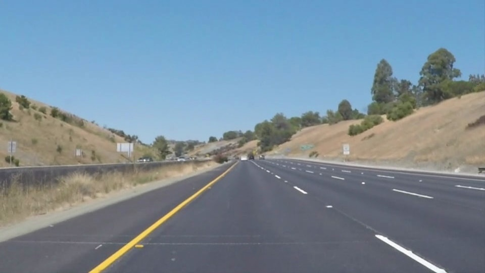
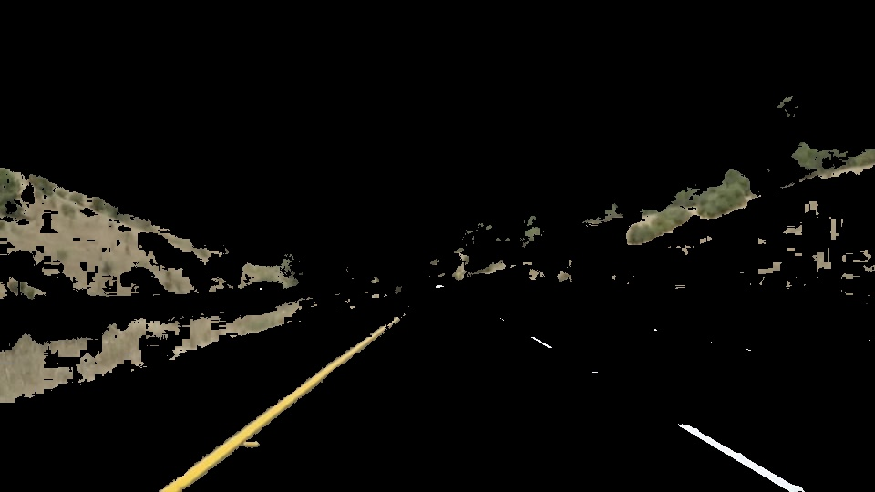
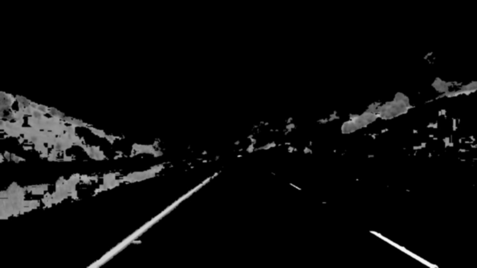
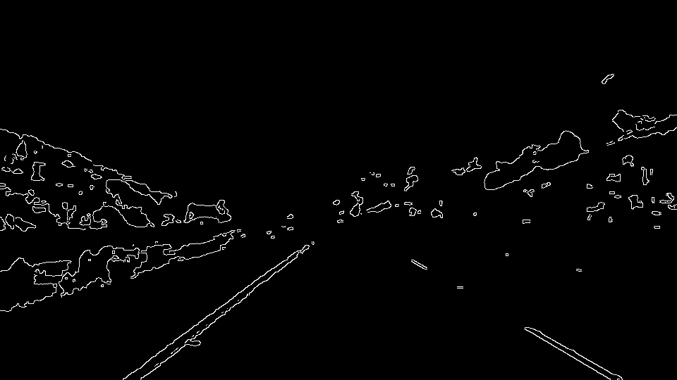
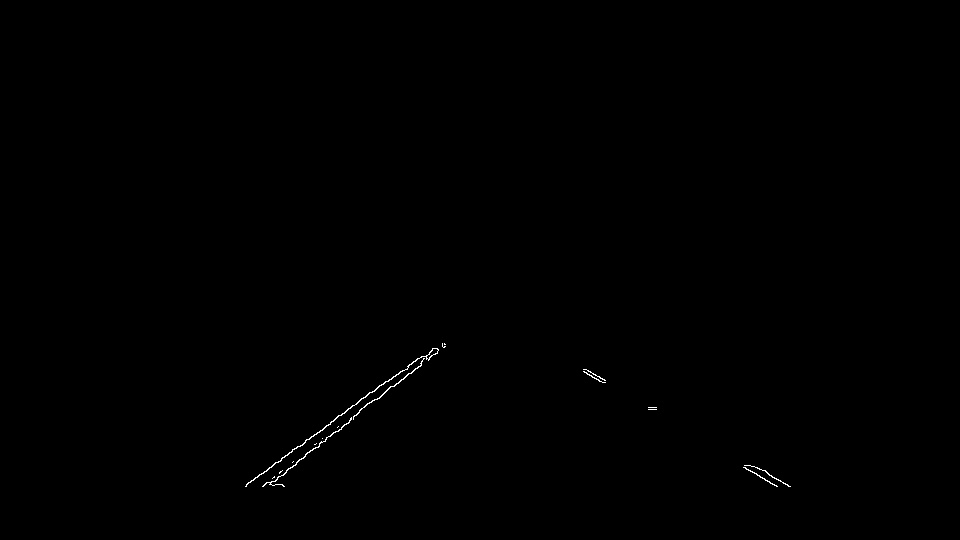
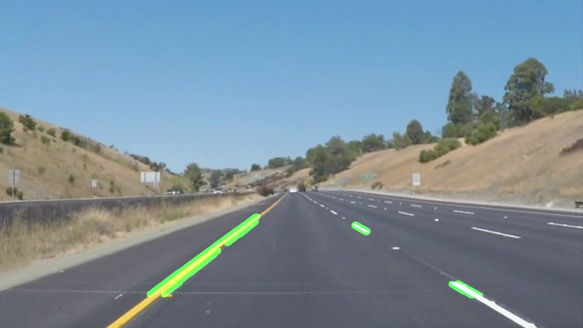
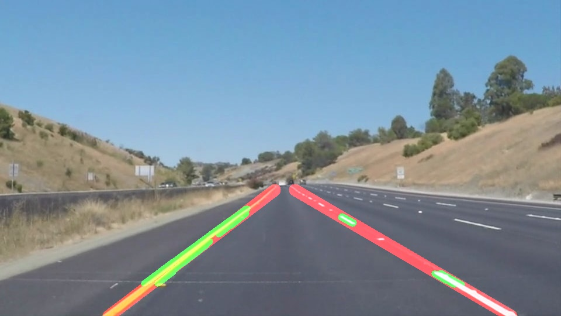

# Finding Lane Lines on the Road

## Overview

This repository contains a Python program to find lane lines on the road.

## Dependencies

* Python 3.5
* NumPy
* OpenCV
* Matplotlib
* MoviePy

## Running the code

### Demo Run

This will use a default video from test_videos, or default image from test_images.
The results will be saved in test_videos_output or test_imaged_output respectively.

"""
python lanelines.py --video-mode

OR

python lanelines.py --image-mode
""" 

### Using with other videos/images

Notice that the output will be saved in a folder like this:  [FOLDER_NAME]_output

"""
python lanelines.py --video-mode --video-path [FOLDER_NAME]/[VIDEO]

OR

python lanelines.py --image-mode --image-path [FOLDER_NAME]/[IMAGE]
""" 

## Reflection

---

**Purpose**

The goals / steps of this project are the following:
* Make a pipeline that finds lane lines on the road
* Reflect on your work in a written report

---

### Pipeline Description

My pipeline consisted of 7 main steps.

#### Segmentation by color

By using cv2.cvtColor(), the image is converted into HSV (to extract yellow colors easily), and HLS (to extract white colors easily). cv2.inRange () generate masks for each respective color range, cv2.bitwise_or() then combines the masks, and cv2.bitwise_and() applies the combined mask to the original image.

This preprocessing step was a simple, yet effective, way to to increase the performance of the pipeline.

#### Grayscaling

The image then is gray-scaled with cv2.cvtColor(). Specific color information is not longer useful after the preprocessing of segmention by color.

#### Gaussian Blur

Gaussian Blur is applied with the cv2.GaussianBlur() function. This step helps dealing with the noise.

#### Canny Edge Detection

cv2.Canny() is used to extract the edges.

#### Masking

cv2.fillPoly() and cv2.bitwise_and() are used to only use the Region of Interest (ROI) of the image.

#### Hough Transform

cv2.HoughLinesP() returns preliminary lines.

#### Extrapolation

First, the slopes of the Hough Transfrom lines are calculated. If one of the slopes is too flat, that specific line is discarded. Then, each line is categorized into "right" or "left" lines, based on the sign of its slope. For each side, the points of the lines are used in np.polyfit to produce a first order Linear Regression that gives the best estimate of the slope and bias.

To stabilize the system, the program remembers the last state (past slope, past bias) for each side. The effective slope is a linear combination of the current slope and the past slope. This could be considered as a low pass filter, and prevents abrupt changes in the slope caused by outliers.

In the image above, the green region are the preliminary Hough Lines, while the red regions are the effective detected lane lines.

### Potential shortcomings of current Pipeline

* The current parameters were selected to work in a small set of data. It is possible that the same parameters will not work for another dataset with different light conditions, image scale, noise profile, etc.

* First order linear regressions, as used in the pipeline, are not fit for very sharp turns, or any other road condition with high curvature.

* The current pipeline only detects the lane in front of the car, not adjacent lanes.

### Possible improvements the Pipeline

* The parameters of the pipeline could be learned through Machine Learning, or use an end-to-end method altogether.

* The current implementation treats everything as individual functions. Putting these functions into a class would be recommended as it gives more strucuture to the code, and prevents bad practices (such a using global variables).

